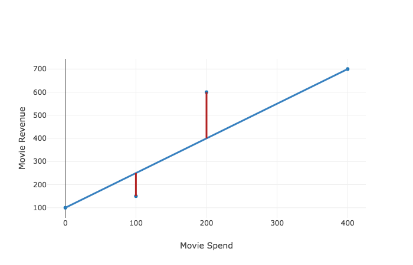

# Evaluating regression lines

### Learning Objectives

* Understand what is meant by the errors of a regression line
* Understand how to calculate the error at a given point
* Understand how to calculate RSS and why we use it as a metric to evaluate a regression line
* Understand the difference between RSS and its variation, the RMSE

### Introduction

So far we have seen how lines and formulas can estimate outputs given an input.  We can describe any straight line with two different variables: 

* $m$ -  the slope of the line, and 
* $b$ - the y-intercept

So far we have been rather fast and loose with choosing a line to estimate our output - we simply drew a line between the first and last points of our data set.  Well today, we go further.  Here, we take our first step toward **training** our model to match our data.

> The first step in training is to calculate our regression line's **accuracy** --  that is, how well our regression line matches our actual data.  Calculating a regression line's accuracy is the topic of this lesson.

In future lessons, we will improve upon our regression line's accuracy, so that it better predicts an output.

### Determining Quality

The first step towards calculating a regression line to predict an output is to calculate how well any regression line matches our data.  We need to calculate how accurate our regression line is.

Let's find out what this means.  Below we have data that represents the budget and revenue of four shows, with `x` being the budget and `y` being the revenue.


```python
first_show = {'x': 0, 'y': 100}
second_show = {'x': 100, 'y': 150}
third_show = {'x': 200, 'y': 600}
fourth_show = {'x': 400, 'y': 700}

shows = [first_show, second_show, third_show, fourth_show]
shows
```

> Run code above with shift + enter

#### An initial regression line
As we did in the last lab, let's draw a not-so-great regression line simply by drawing a line between our first and last points.  We can use our `build_regression_line` function to do so.  You can view the code directly [here](https://github.com/learn-co-curriculum/evaluating-regression-lines/blob/master/linear_equations.py).  
> Eventually, we'll improve this regression line.  But first we need to see how good or bad a regression line is.


```python
from linear_equations import build_regression_line
x_values = list(map(lambda show: show['x'],shows))
y_values = list(map(lambda show: show['y'],shows))
regression_line = build_regression_line(x_values, y_values)
regression_line
```

We can plot our regression line as the following using the [plotting functions](https://github.com/learn-co-curriculum/evaluating-regression-lines/blob/master/graph.py) that we wrote previously:


```python
from graph import m_b_trace, plot, trace_values
from plotly.offline import iplot, init_notebook_mode
init_notebook_mode(connected=True)
data_trace = trace_values(x_values, y_values)
regression_trace = m_b_trace(regression_line['m'], regression_line['b'], x_values)
plot([regression_trace, data_trace])
```

So that is what our regression line looks like.  And this the line translated into a function.


```python
def sample_regression_formula(x):
    return 1.5(x) + 100
```

#### Assessing the regression line

Ok, so now that we see what our regression line looks like, let's highlight how well our regression line matches our data.



> Let's interpret the chart above.  That first red line shows that our regression formula does not perfectly predict that first show.   
> * Our actual data -- the first blue dot -- shows that when $x = 100$, $y =  150$.  
> * However, our regression line predicts that at $x = 100$, $y = 250$.  

> So **our regression line is off by 100, indicated by the length of the red line.** 

Each point where our regression line's estimated differs from the actual data is called an **error**.  And our red lines display the size of this error.  The length of the red line equals the size of the error.  
* The **error** equals the difference between the *actual* value and the value *expected* by our model (that is, our regression line).  
* error = actual - expected

Now let's put this formula into practice.  The error is the actual value minus the expected value.  So at point $x = 100$, the actual $y$ is 150.  And at point x = 100, the expected value of $y$ is $250$.  So: 
* error = $150 - 250 = -100$.  

If we did not have a graph to display this, we could calculate this error by using our formula for the regression line.  

* Our regression formula is $y = 1.5x + 100$.  
* Then when $x$ equals 100, the formula predicts $y = 1.5 * 100 + 100 = 250$.  
* And we have the actual data of (100, 150).  So 
* `actual` - `expected` $ = 150 -250 = -100$.

### Refining our Terms

Now that we have explained how to calculate an error given a regression line and data, let's learn some mathematical notation that let's us better express these concepts.  

* We want to use notation to distinguish between two things: our expected $y$ values and our actual $y$ values.  

#### Expected values

So far we have defined our regression function as $y = mx + b$.  Where for a given value of $x$, we can calculate the value of $y$.  However, this is not totally accurate - as our regression line is not calculating the actual value of $y$ but the *expected* value of $y$. So let's indicate this, by changing our regression line formula to look like the following:

* $\hat{y} = \hat{m}x + \hat{b}$ 

Those little dashes over the $y$, $m$ and $b$ are called hats.  So our function reads as y-hat equals m-hat multiplied by $x$ plus b-hat.  These hats indicate that this formula does not give us the actual value of $y$, but simply our estimated value of $y$.  The hats also say that this estimated value of $y$ is based on our estimated values of $m$ and $b$. 
> Note that $x$ is not a predicted value.  This is because we are *providing* a value of $x$, not predicting it.  For example, we are providing an show's budget as an input, not predicting it.  So we are *providing* a value of $x$ and asking it to *predict* a value of $y$.  

#### Actual values

Now remember that we were given some real data as well.  This means that we do have actual points for $x$ and $y$, which look like the following.


```python
first_show = {'x': 0, 'y': 100}
second_show = {'x': 100, 'y': 150}
third_show = {'x': 200, 'y': 600}
fourth_show = {'x': 400, 'y': 700}

shows = [first_show, second_show, third_show, fourth_show]
shows
```

So how do we represent our actual values of $y$? Here's how: $y$.  No extra ink is needed.

Ok, so now we know the following:  
 * **$y$**: actual y  
 * **$\hat{y}$**: estimated y
 
Finally, we use the Greek letter $\varepsilon$, epsilon, to indicate error. So we say that 
* $\varepsilon = y - \hat{y}$.  

We can be a little more precise by saying we are talking about error at any specific point, where $y$ and $\hat{y}$ are at that $x$ value.  This is written as: 

$\varepsilon _{i}$ = $y_{i}$ - $\hat{y}_{i}$

Those little $i$s represent an index value, as in our first, second or third movie.  Now, applying this to a specific point of say when $ x = 100 $, we can say:
* $\varepsilon _{x=100} = y_{x=100}$ - $\hat{y}_{x=100} = 150 - 250 = -100$

### Calculating and representing total error

We now know how to calculate the error at a given value of $x$, $x_i$, by using the formula, $\varepsilon_i$ = $y_i - \hat{y_i}$.  Again, this is helpful at describing how well our regression line predicts the value of $y$ at a specific point.  

However, we want to see well our regression describes our dataset in general - not just at a single given point.  Let's move beyond calculating the error at a given point to describing the total error of the regression line across all of our data.  

As an initial approach, we simply calculate the total error by summing the errors, $y - \hat{y}$, for every point in our dataset.  

Total Error = $\sum_{i=1}^{n} y_i - \hat{y_i}$

This isn't bad, but we'll need to modify this approach slightly. To understand why, let's take another look at our data.


The errors at $x = 100$ and $x = 200$ begin to cancel each other out. 

* $\varepsilon_{x=100}= 150 - 250 = -100$
* $\varepsilon_{x=200} = 600 - 400 = 200$  
* $\varepsilon_{x=100} + \varepsilon_{x=200} =  -100 + 200 = 100 $

We don't want the errors to cancel each other out!  To resolve this issue, we square the errors to ensure that we are always summing positive numbers.

${\varepsilon_i^2}$ = $({y_i - \hat{y_i}})^2$

So given a list of points with coordinates (x, y), we can calculate the squared error of each of the points, and sum them up.  This is called our ** residual sum of squares ** (RSS).  Using our sigma notation, our formula RSS looks like: 

$ RSS  = \sum_{i = 1}^n ({y_i - \hat{y_i}})^2 = \sum_{i = 1}^n \varepsilon_i^2 $

> Residual Sum of Squares is just what it sounds like.  A residual is simply the error -- the difference between the actual data and what our model expects.  We square each residual and add them together to get RSS.

Let's calculate the RSS for our regression line and associated data.  In our example, we have actual $x$ and $y$ values at the following points: 
* $ (0, 100), (100, 150), (200, 600), (400, 700) $.  

And we can calculate the values of $\hat{y} $ as $\hat{y} = 1.5 *x + 100 $, for each of those four points.  So this gives us:

$RSS = (100 - 100)^2 + (150 - 250)^2 + (600 - 400)^2 + (700 - 700)^2$ 

which reduces to  

$RSS = 0^2 + (-100)^2 + 200^2 + 0^2 = 50,000$

Now we have one number, the RSS, that represents how well our regression line fits the data.  We got there by calculating the errors at each of our provided points, and then squaring the errors so that our errors are always positive.

### Root Mean Squared Error

Root Mean Squared Error (RMSE), is just a variation on RSS.  Essentially, it tries to answer the question of what is the "typical" error of our model versus each data point.  To do this, it scales down the size of that large RSS number by taking the square root of the RSS divided by the number of data points:

* $ RSS  = \sum_{i = 1}^n ({y_i - \hat{y_i}})^2$  
 
* $RMSE = \sqrt{\frac{RSS}{n}} $   
> Where n equals the number of elements in the data set.

Now let's walk through the reasoning for each step. 

#### Taking the mean
The first thing that makes our RSS large is the fact that we square each error.  Remember that we squared each error, because we didn't want positive errors and negative errors to cancel out.  Remember, we said that each place where we had a negative error, as in :

> $actual - expected = -100$  

We would square the error, such that $(-100)^2 = 10,000$.

Remember that we square each of our errors and add them together, which led to:

* $RSS = 0^2 + (-100)^2 + 200^2 + 0^2 = 50,000$

We then take the mean to get the average squared error (also called "mean squared error" or "MSE" for short:

* $MSE = \frac{50,000}{4}=12,500$

We do this because with each additional data point in our data set, our error will tend to increase. So with increasing dataset size, RSS also increases. To counteract the effect of RSS increasing with the dataset size and not just accuracy, we divide by the size of the dataset. 

#### Taking the square root

The last step in calculating the RMSE, is to take the square root of the MSE:

$RMSE = \sqrt{12,500} = 111.8$

In general, the RMSE is calculated as:  
$ RMSE  = \sqrt{\frac{\sum_{i = 1}^n ({y_i - \hat{y_i}})^2}{n}} $

So the RMSE gives a typical estimate of how far each measurement is from the expectation.  So this is "typical error" as opposed to an overall error.

### Summary 

Before this lesson, we simply assumed that our regression line made good predictions of $y$ for given values of $x$.  In this lesson, we learned a metric that tells us how well our regression line fits our actual data.  To do this, we started looking at the error at a given point, and defined error as the actual value of $y$ minus the expected value of $y$ from our regression line.  Then we were able to determine how well our regression line describes the entire dataset by squaring the errors at each point (to eliminate negative errors), and adding these squared errors.  This is called the Residual Sum of Squares (RSS).  This is our metric for describing how well our regression line fits our data.  Lastly, we learned how the RMSE tells us the "typical error" by dividing the square root of the RSS by the number of elements in our dataset.
